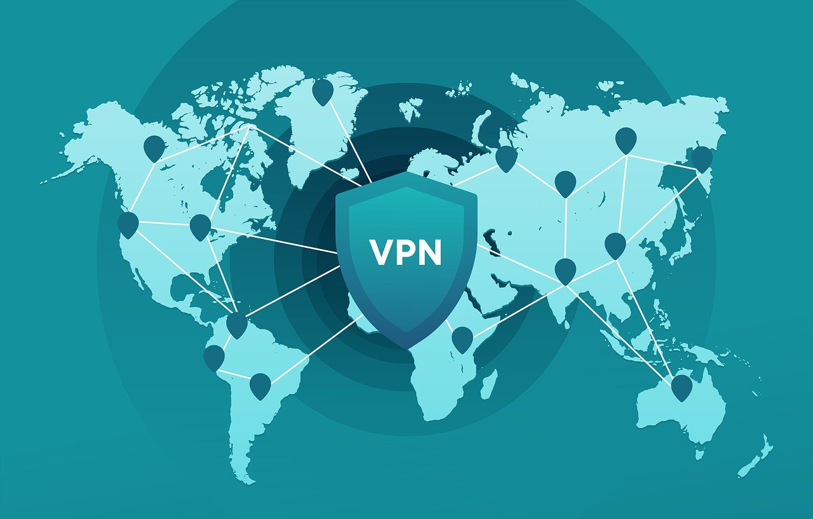

# Poor man's VPN (pay for only what you need)

An ansible playbook to quickly set up [Wireguard](https://www.wireguard.com/) server for occasional personal use. It takes around five minutes to set this up. Spin up a VM, run the playbook, do your business and delete the VM.

Motivation: Lately due to GDPR many websites are blocking access in the EU. For me, I cannot order medicines back home via netmeds.com or book flights/hotels via makemytrip.com (as of December 2021). With wireguard and this playbook it becomes trivial to perform these tasks for very little cost.

<div style="text-align:center;">


*https://pixabay.com/illustrations/map-world-vpn-international-4636843/*
</div>

## Setup
- Create a vm at your desired location from your favorite provider
  - I have tested with a $5 DigitalOcean droplet with Ubuntu 20.04 LTS
- Make sure you can `ssh` into the machine with default public key
- Install & start the wireguard client app
- Create an empty tunnel
- Copy the client public key

## Create python environment
```
virtualenv venv
source venv/bin/activate
pip install -r requirements.txt
deactivate
```
## Run the playbook
*Make sure your wireguard connection is deactivated*
```
source venv/bin/activate
ansible-playbook -i <server public ip>, -u <server username> playbook.yaml
```
#### Prompts
```
Client public key: <copy from wireguard client app>
Allowed IPs [10.0.0.3]: 
Wireguard listen port [51820]: 
```
> Running the playbook multiple times will change the server private/public keys. 
> Make sure to copy the new public key into the client config each time.

## Client configuration
Edit the tunnel configurations so that it looks like this
```
[Interface]
PrivateKey = <auto generated for client>
Address = 10.0.0.3/24
DNS = 1.1.1.1, 1.0.0.1

[Peer]
PublicKey = <server wg public key / changes every time we run the playbook>
AllowedIPs = 0.0.0.0/0
Endpoint = <server public ip>:<wg port>
```
